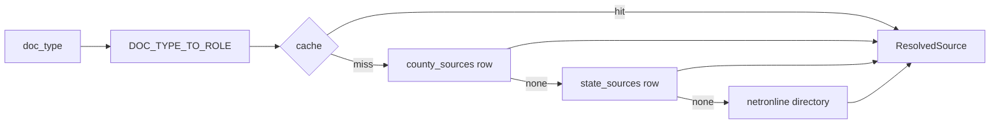

# County-Source Catalog — Production Design

**Scope:** how ResearchHub *stores* and *retrieves* the county portal URLs it points each
document type at, and how to take that from POC-grade (hardcoded Python + a JSON blob) to
production-grade (queryable, editable, verified, observable) — **without** losing any of the
curation already in `data/`.

This note is deliberately narrow. It does **not** re-litigate the coverage roadmap
(`07-opportunities-roadmap.md`: scrapers, paid APIs) — that adds *sources*. This adds the
*data layer those sources are addressed through*.

---

## 1. What the catalog is today

The "which website for this county × this document" mapping is spread across four in-code
places, resolved at request time:

| Where | What it holds | Read path |
|---|---|---|
| `data/county_platforms.py` → `REGISTRY` | per-county dict keyed by 5-digit FIPS: `clerk_url`, `clerk_platform`, `clerk_note`, `appraiser_url`, `appraiser_api`, `gis_rest`, `plat_url`, `parcel_layer_hint` | `lookup(fips)` |
| `data/states/*.py` | `STATE_COUNTIES` overrides + `STATE_DEED` / `STATE_PLAT` / `STATE_APPRAISER` statewide fallbacks | merged into `REGISTRY` at import |
| `data/records_links.json` | 351 bulk-verified county links w/ `_src_*` provenance | `_merge_bulk_links()` at import (`setdefault`, curated wins) |
| `services/clerk.py` → `references()` | the **doc-type → URL** decision itself | called per run in `resolve_property_context` |

The last row is the one that matters most for the ask. `references()` hardcodes the mapping:

```python
# services/clerk.py — the implicit doc-type → website rule
plat_url  = reg.get("plat_url")  or STATE_PLAT[state]  or clerk_url          # plat
clerk_url = reg.get("clerk_url") or STATE_DEED[state]  or netronline(...)    # deed + everything clerk
appraiser_url = reg.get("appraiser_url") or STATE_APPRAISER[state] or netronline(...)  # parcel + appraiser
```

and in `orchestration/sources.py`, **every** other clerk doc type collapses onto the same URL:

```python
def _clerk_url(ctx, doc_key):
    return ctx.clerk_ref["plat_search"] if doc_key == "plat" else ctx.clerk_ref["official_records_search"]
# deed, adjoiners, easements, prior_survey, condo  → one identical clerk link
```

So at runtime there are really only **three** distinct county URLs (clerk, plat, appraiser)
behind ten document types. That is fine while the truth is "one county, one records portal,"
but it is already lossy where it isn't — a county that indexes easements or mortgages
separately, or an assessor whose GIS differs from its tax card, has nowhere to be represented.

## 2. Why this is a production risk (not just untidy)

Grounded in the current code, not hypotheticals:

1. **Every URL fix is a code change + redeploy.** Portals move constantly — the briefing itself
   notes Volusia `/or/` → `/or_m/`. An analyst who spots a dead clerk link cannot fix it; it
   needs an engineer, a PR, and a release. At national scale (3,144 counties × ~3 roles ≈ 9k+
   URLs) that is the dominant maintenance cost.
2. **Freshness is invisible.** `services/http.py:check_url` and `/api/linkcheck` exist, but they
   run **on the user's network, on demand, one URL at a time**. Nothing sweeps the catalog on a
   schedule, so URL rot is discovered only when a live job silently degrades to a NETROnline
   directory link. `clerk_note` "verified 2026-07-20" is a *comment*, not a queryable
   `last_verified_at`.
3. **Squatter/dead state lives in prose.** `tx.py` documents that `bellcad.com`, `webbcad.com`,
   `cameroncad.com` are domain squatters — knowledge that is invaluable and completely
   invisible to the running system. It belongs in a `verified_status` column, set by an
   automated check.
4. **No SQL view of the catalog.** The source-of-truth is Python dicts, so you cannot ask
   "which counties are missing a plat URL," "which links haven't been verified in 90 days," or
   join coverage to order volume — except by recomputing `/api/reference/coverage` live from the
   in-memory registry.
5. **Import-time cost in every process.** `_merge_bulk_links()` parses a 103 KB JSON on every
   web + worker cold start and holds the merged dict resident in each. A national dataset makes
   that a real memory/cold-start line item across a Celery fleet.
6. **No telemetry on degradation.** `references()` computes an `automation_status` string, but no
   metric records how often a *real* GA plat request falls back to link-only. You can't
   prioritize curation by measured pain.

## 3. Target model — one row per (county, source role)

Promote the catalog to a first-class, versioned table. Keep the granularity at the **source
role** (the distinct portal), not the request `DocumentType` — many doc types legitimately
share one portal, and a role can serve several doc types.

```python
# app/engine/models.py  (same conventions you already use: Mapped[], mixins, __versioned__)

class CountySource(Base, TimestampMixin, AuditMixin, SoftDeleteMixin):
    __tablename__ = "county_sources"
    __versioned__: dict = {}                       # full edit history, like research_jobs
    __table_args__ = (
        UniqueConstraint("county_fips", "doc_role",
                         name="uq_county_source_role"),   # one active portal per role
    )

    county_fips: Mapped[str]  = mapped_column(String(5), index=True)   # "12127"
    state:       Mapped[str]  = mapped_column(String(2), index=True)
    county_name: Mapped[str]  = mapped_column(String(120))

    doc_role: Mapped[SourceRole] = mapped_column(SQLEnum(SourceRole), index=True)
    # SourceRole = clerk_deed | clerk_plat | clerk_easement | clerk_condo |
    #              appraiser | parcel_gis | ...   (extendable without a migration to callers)

    url:        Mapped[str]        = mapped_column(String(2048))
    api_url:    Mapped[str | None] = mapped_column(String(2048))   # structured endpoint if any
    platform:   Mapped[str | None] = mapped_column(String(40))     # acclaim|landmark|eagle|publicsearch|inhouse
    method:     Mapped[Method]     = mapped_column(SQLEnum(Method)) # link|scraper|arcgis_rest|featureserver|ftp_bulk
    layer_hint: Mapped[str | None] = mapped_column(String(120))
    note:       Mapped[str | None] = mapped_column(Text)

    # provenance + trust — the knowledge currently trapped in docstrings/comments
    source_ref:      Mapped[str | None] = mapped_column(Text)          # where discovered/verified
    confidence:      Mapped[str] = mapped_column(String(16), default="curated")  # curated|scraped|guessed
    verified_status: Mapped[str] = mapped_column(String(16), default="unverified")
    #   ok | dead | blocked | squatter | unverified   ← set by the sweeper (§6)
    http_status:     Mapped[int | None]
    verified_at:     Mapped[datetime | None]
    last_checked_at: Mapped[datetime | None]
    is_active:       Mapped[bool] = mapped_column(Boolean, default=True)
```

Statewide fallbacks (`STATE_DEED`/`STATE_PLAT`/`STATE_APPRAISER`) get a sibling `state_sources`
table (or `county_fips='STATE:GA'` sentinel rows — a table is cleaner). NETROnline stays a
computed universal fallback (`netronline()`), never stored — it's derivable and always exists.

**This table is global, not tenant-scoped** — the catalog is the same for every tenant. Keep it
that way; gate *edits* behind an admin role instead.

## 4. Make the doc-type → role mapping explicit

Replace the implicit rule in `clerk.references()` / `_clerk_url()` with a declared mapping that
lives next to the existing `STEP_TO_DOC_TYPE` in `engine/adapters.py`:

| Requested `DocumentType` | `SourceRole` | Fallback role |
|---|---|---|
| `PARCEL_RECORD` | `parcel_gis` | `appraiser` |
| `PROPERTY_APPRAISER_TAX_RECORD` | `appraiser` | — |
| `DEED_SUBJECT_PARCEL` | `clerk_deed` | — |
| `RECORDED_PLAT_SUBDIVISION_MAP` | `clerk_plat` | `clerk_deed` |
| adjoiners / prior_survey | `clerk_deed` | — |
| easements | `clerk_easement` | `clerk_deed` |
| condo | `clerk_condo` | `clerk_deed` |
| `FEMA_FLOOD_ZONE_FIRM`, `NGS_CONTROL` | *(federal — not county)* | — |

Now a county that splits deeds from easements can say so; a county that doesn't just leaves the
specialized role empty and the resolver walks the fallback chain — identical behavior to today,
but *expressible* when the truth is richer.

## 5. Retrieval — a repository + cache in front of the table

Add `CountySourceRepository` mirroring `ResearchJobRepository`'s static-method style, with one
resolver that encodes the whole fallback chain in one place:

```python
def resolve(db, *, county_fips, state, county_name, doc_type) -> ResolvedSource:
    role, fallback = DOC_TYPE_TO_ROLE[doc_type]
    row = (CountySourceRepository.get(db, county_fips, role)
           or (fallback and CountySourceRepository.get(db, county_fips, fallback))
           or StateSourceRepository.get(db, state, role)
           or ResolvedSource.directory(netronline(state, county_name)))   # universal fallback
    return row
```

Because the catalog changes rarely, wrap reads in an **in-process TTL/LRU cache** (or Redis for
a multi-worker fleet), invalidated explicitly on admin edit. That kills both the per-request DB
hit *and* the import-time `_merge_bulk_links()` load and resident dict. `resolve_property_context`
(`orchestration/context.py`) and `clerk.references()` become thin callers of this resolver.



## 6. Freshness — turn `check_url` into a scheduled catalog sweep

The verdict logic already exists (`http.py:check_url` → `ok|blocked|broken|offline`). Wrap it in
a Celery-beat job that walks `county_sources` on a cadence (e.g. weekly, prioritized by order
volume: FL/GA/TX first) and writes `verified_status`, `http_status`, `last_checked_at` back to
each row. Rules that fall straight out of the existing verdicts:

- `blocked` (401/403/406/429) → **not dead** — WAF/bot block, opens in a browser. Keep active.
- `broken` (404/410/5xx) → flag `dead`, alert, keep serving the link (still better than nothing)
  but surface it on an ops dashboard.
- content heuristic → `squatter` (the `tx.py` "Coming Soon" / ad-redirect case), so that
  knowledge stops living in a docstring.

A `county_sources` health view (`WHERE verified_status IN ('dead','squatter') ORDER BY <volume>`)
becomes the curation work-queue — replacing "someone notices a job degraded."

## 7. Observability — measure degradation from real jobs

`research_documents` already stores `source_outcome`, `link`, `status` per doc. Add a lightweight
rollup (materialized view or a periodic aggregate) keyed by `(state, county_fips, doc_role)`
counting **auto-fetch vs link-only vs directory-fallback**. That answers "what % of GA plat
requests degrade to a directory link" with data, and lets P1–P4 in the roadmap be sequenced by
*measured* order-weighted pain rather than the static coverage snapshot.

## 8. Keep Python/JSON as the *seed*, not the runtime truth

Nothing curated is thrown away. The migration is additive:

- The current `REGISTRY` + `states/*` + `records_links.json` become the input to an idempotent
  `scripts/seed_county_sources.py` that **upserts** rows (carrying `_src_*` → `source_ref`,
  `clerk_note` → `note`, verified dates → `verified_at`). Run it in CI on merge.
- Engineers who prefer curating in Python still can — the seeder writes the same rows. Ops who
  need a fast fix edit the row directly. Both paths converge on one table.
- The merge-precedence rule (curated state-module value wins; bulk JSON only fills gaps) is
  preserved as **upsert precedence** in the seeder, so `build_records_links.py` regeneration
  never clobbers a hand-verified row — same guarantee as `setdefault` today.

## 9. Phased rollout (non-breaking)

| Phase | Ships | Risk |
|---|---|---|
| **0** | `county_sources` + `state_sources` tables, `SourceRole`/`DOC_TYPE_TO_ROLE`, seeder, repository + resolver behind a `CATALOG_SOURCE=db\|code` flag defaulting to **code** | none — dormant |
| **1** | Flip resolver to **db-first, code-fallback**; add the cache; verify byte-for-byte parity of `references()` output on the FL/GA/TX regression set | low — old path still there |
| **2** | Freshness sweeper + health dashboard; fallback telemetry rollup | additive |
| **3** | Admin edit surface (RBAC-gated); retire import-time `_merge_bulk_links()`; `code` path becomes seed-only | medium |

Parity gate for Phase 1: run the existing coverage endpoint and a diff of `clerk.references()`
for all 3,144 FIPS through both paths — they must match before the flag flips.

## 10. What *not* to change

- **`netronline()` universal fallback** — every county on Earth keeps a link. Leave it computed.
- **The situs/coverage trust gates** in `parcel.py` (§3 of the registry briefing) — orthogonal
  to this; don't fold URL storage and parcel-coverage verification together.
- **The scraper adapters** — they consume a resolved URL; they don't care where it's stored.
- **Multi-tenant scoping** — the catalog stays global; only edits are gated.

---

### One-line summary

Lift the county-website catalog out of Python dicts into a versioned `county_sources` table
keyed by **(county_fips, source_role)**, resolve each `DocumentType` to a role through an
explicit map, read it through a cached repository with the same fallback chain you have today,
and let a scheduled sweep keep it honest. Same behavior on day one; editable, verifiable, and
observable from day two.
