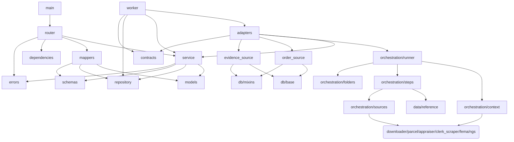

# 02 — Engine Deep Dive (Backend team)

The complete map of `researchhub-engine`. Every module, its functions, what they do, and how
they link. All citations are relative to the repo root.

## 0. The shape

```
backend/app/engine/
  contracts.py          canonical vocabulary (enums + result models) — the single source of truth
  schemas.py            /api/v1/research/* request/response models (the wire contract)
  models.py             ORM: research_jobs + research_documents
  repository.py         thin query layer (tenant-scoped)
  service.py            ResearchService — job lifecycle business logic
  router.py             the 5 HTTP endpoints
  dependencies.py       tenant/actor deps (header placeholders)
  mappers.py            ORM → contract models (incl. FileReference)
  adapters.py           production wiring (order_provider, document_fetcher, build_research_service)
  worker.py             Celery app + research_job task + enqueue_research_job
  order_source.py       dev `orders`/`tenants` stand-in + seed_dev_order
  evidence_source.py    dev `files`/`order_files` stand-in + create_evidence/get_file_reference
  errors.py             exception hierarchy mapped to HTTP codes
  orchestration/
    context.py          Phase A — resolve_property_context → PropertyContext
    sources.py          SourceAdapter interface + 11 adapters + ADAPTERS registry
    steps.py            build_steps — include-aware, per-step fallback + status/provenance
    runner.py           run_research — wires Phase A + Phase B
    folders.py          staging folder + manifest.json/result.json writers
```

### Dependency (import) graph — who links to whom



Two rules keep this sane: **(1)** `contracts.py` is imported by everything and imports nothing of
the app (the vocabulary must never import app code); **(2)** `adapters.py` is the only place that
knows "which concrete services feed the pipeline" — the service layer only sees injected
callables.

## 1. The vocabulary — `contracts.py`

The frozen + additive model. The six frontend-facing step statuses **never change meaning**:

| Enum | Values | Notes |
|---|---|---|
| `StepStatus` (`contracts.py:20`) | `ok` `link` `empty` `error` | **frozen** — what the FE renders |
| `SourceOutcome` (`contracts.py:28`) | `auto` `link_only` `blocked` `broken` `retryable` `manual_review` | engine's *why* — replaces the old ad-hoc if/elif chains |
| `Confidence` (`contracts.py:51`) | `high` `medium` `low` `none` | does it actually pertain to the parcel? |
| `JobState` (`contracts.py:59`) | `queued running completed partial failed reviewed archived` | persisted job lifecycle |
| `SourceState` (`contracts.py:79`) | `idle fetching fetched failed unavailable` | the per-source UI rail states |

Models: `ProvenanceRecord` (source_id, provider, url, retrieved_utc, attempt, fallback_chain,
file, sha256), `ErrorInfo` (code, message, retryable), `StepResult` (the canonical per-step
shape — 15+ frozen fields, 5 additive: `source_outcome`, `confidence`, `provenance`, `warnings`,
`error`), `ResearchResult` (top-level payload — frozen fields match the POC `result.json`
exactly, additive ones like `completed_utc`/`job_state`/`docs_dir`/`survey_type` ride alongside)
(`contracts.py:95-213`).

## 2. The wire contract — `schemas.py`

**Enums:** `ResearchJobStatus` (`queued running completed partial failed cancelling cancelled`),
`ResearchDocStatus` (`queued fetching fetched uploading uploaded failed skipped`),
`ResearchErrorCode` (client 4xx / per-document / system 5xx — full list at `schemas.py:81`).

**Requests:** `CreateResearchJobRequest {order_id, document_types[], idempotency_key?}`
(`schemas.py:121`), `RetryResearchJobRequest {document_types?}` (`:145`), `CancelJobRequest
{reason?}` (`:160`).

**Responses:** `FileReference {file_id, order_file_id, key, filename, size_bytes, sha256,
mime_type}` (`:178`), `ResearchDocument` (per-doc: status, source_outcome, confidence, file,
summary, link, provenance, errors) (`:190`), `ResearchJob` (the poll target) (`:241`),
`ResearchJobSummary` (list form) (`:280`). Everything is wrapped in the parent-style envelope:
success `{data: …}`, error `{error: {code, message, details?}}` (`:298`).

These are **exported** to `contracts/openapi.json` + `contracts/schemas/*.json` by
`scripts/export_contracts.py` and treated as frozen — the only way to change them is to change
the code, re-run the export, and show a clean diff.

## 3. The tables — `models.py`

### `research_jobs` (one row per run)
`tenant_id` (indexed, isolation key), `order_id` (indexed), `idempotency_key` (unique per
tenant), `requested_doc_types` (JSONB), `status` (SQL enum), denormalized counters
`total/fetched/uploaded/failed/cancelled_documents`, `started_at`/`completed_at`, top-level
`error_code`/`error_message`, optional `callback_url`, audit/timestamp/soft-delete mixins
(`models.py:50-201`). Unique `(tenant_id, idempotency_key)`.

> **Why denormalized counters?** So the jobs list page can render without counting child rows on
> every poll. `recalc_job_counters` keeps them in sync (`service.py:86`).

### `research_documents` (one row per requested doc type)
`job_id` → `research_jobs.id` (CASCADE, kept as a real FK), `order_id` (denormalized), `doc_type`,
`status`, `source_outcome`/`confidence` (engine-only), `file_id`/`order_file_id` (set after
upload — plain UUID columns *here*; **FKs are restored at parent integration**), `summary`,
`link`, `link_label`, `provenance` (JSONB), `warnings` (JSONB), `error_code`/`error_message`,
`retryable`, `retry_count`, `fetched_at`/`uploaded_at` (`models.py:204-377`). Unique
`(job_id, doc_type)`.

### The base tables and the alembic chain

```
0002_dev_base_tables.py   (down_revision=None)  tenants · orders · files · order_files   ← dev shim
0001_research_tables.py   (down_revision=0002)  research_jobs · research_documents       ← FKs onto the shim
```

`0002` comes **first** because `0001`'s `order_id → orders.id`, `tenant_id → tenants.id`,
`file_id → files.id`, `order_file_id → order_files.id` FKs need those tables to exist on a fresh
database. At parent integration: **drop `0002`**, retarget `0001.down_revision` onto the parent's
chain, and the FKs point at the parent's real tables. Run `alembic upgrade head` from the **repo
root** (`alembic.ini` → `script_location = backend/alembic`).

Dev quick-path: `RUN_ENV=local` triggers `Base.metadata.create_all` at startup instead
(`backend/app/main.py`), so SQLite/laptop development never needs a migration run.

## 4. The repository — `repository.py`

`ResearchJobRepository`: `get(db, job_id, tenant_id)` (tenant + soft-delete scoped),
`get_by_idempotency`, `list_for_order` (newest first), `create`, `save`.
`ResearchDocumentRepository`: `get`, `list_for_job`, `list_failed`, `create`, `save`.

Nothing clever; the cleverness is that **every query is tenant-scoped** — a caller can never see
another tenant's rows even if a bug slips in upstream.

## 5. The service — `service.py`

### The two domain dataclasses
- `OrderData` (`service.py:40`): the **minimal** order interface the engine needs — id,
  address_line_1, city, state, county, parcel_id, lat/lon, survey_type. During integration an
  adapter builds this from `app/modules/orders`; the stand-alone `order_source` builds it from
  the dev `orders` table.
- `FetchedDocument` (`service.py:60`): the result of fetching one doc type — doc_type, status,
  summary/link/link_label, and the evidence linkage fields (`file_key`, `file_size`, `sha256`,
  `file_id`, `order_file_id`) plus provenance/warnings/error fields.

### `ResearchService` — the whole job lifecycle
Constructor takes **four injected dependencies** (`service.py:125`), which is how tests run fully
offline:

| Dependency | Signature | Production wiring |
|---|---|---|
| `order_provider` | `(order_id, tenant_id) → OrderData | None` | `adapters.order_provider` → dev `orders` table |
| `document_fetcher` | `(order, doc_types[], tenant_id?) → dict[str, FetchedDocument]` | `adapters.build_document_fetcher()` |
| `file_storage` | object with `save_file(...)` | kept for interface completeness (the fetcher path uses `services.storage` directly) |
| `enqueue` | `(job_id, tenant_id, actor_id)` | `worker.enqueue_research_job`; `None` = skip (tests/standalone) |

Public methods:
- `create_job` (`:149`) — resolve order → validate doc-types → idempotency check → create job +
  document rows → **commit** → enqueue. Returns the job. The commit-before-enqueue ordering is
  what guarantees the worker always finds a committed row.
- `get_job` (`:182`), `list_order_jobs` (`:188`).
- `retry_job` (`:193`) — only terminal jobs; collects failed doc types (or a caller subset);
  **creates a NEW job** (the original is never mutated — the audit trail stays intact).
- `cancel_job` (`:224`) — only `queued`/`running`; sets `cancelled`. (In-flight documents finish
  their current step; queued ones become `skipped` in the worker.)
- `_resolve_order` (`:238`) — 404 `OrderNotFoundError` if the order is absent, 422
  `OrderNotResearchableError` if it has no address.
- `_validate_doc_types` (`:248`) — **normalizes legacy aliases** (`"flood"` → `FEMA_FLOOD_ZONE_FIRM`,
  any casing; step short-names → canonical), dedups preserving first-occurrence order, rejects
  unknowns with `InvalidDocTypesError`. This accepts what the client contracts actually send.

Module-level helpers: `recalc_job_counters` (`:86`) and `resolve_job_terminal_status` (`:99`) —
the "all ok → completed / some failed → partial / none ok → failed" logic.

## 6. The HTTP surface — `router.py`

Five endpoints under `prefix="/api/v1/research"` (`router.py:39`):

| Method/path | Function | What it does |
|---|---|---|
| `POST /research/jobs` | `create_research_job` (:71) | create + enqueue; takes `X-Idempotency-Key` header |
| `GET /research/jobs/{job_id}` | `get_research_job` (:104) | the poll target |
| `POST /research/jobs/{job_id}/retry` | `retry_research_job` (:131) | new job for failed docs |
| `POST /research/jobs/{job_id}/cancel` | `cancel_research_job` (:162) | cancel running/queued |
| `GET /research/orders/{order_id}/jobs` | `list_order_jobs` (:183) | history for an order |

Every handler reads `actor_id`/`tenant_id` from the dependency overrides and calls
`get_service` → `adapters.build_research_service()` (`:46`). **This single shared
construction is what fixed the "worker built a service with `None` dependencies" bug** — the API
and the worker literally call the same function.

Auth note: the docstring at `router.py:15` says the current header-based deps are a *placeholder*
to be replaced by Cognito wiring at integration. The endpoint signatures don't change.

## 7. The worker — `worker.py`

Celery app (`:30`) configured with `task_acks_late=True` + `worker_prefetch_multiplier=1` (a
worker crash **requeues** the task rather than dropping it), JSON serialization, and a dedicated
`research` queue.

`enqueue_research_job` (`:46`) — called by `create_job`; coerces UUIDs and publishes
`research_job.delay(...)`.

`research_job` task (`:61`) — the only place the orchestrator runs. Step by step:

1. `build_research_service()`; set `running` + `started_at` (`:67-78`).
2. Pull documents; fetch the order via `order_provider` (`:80-81`).
3. Per document (`:83-120`):
   - cancelled job → mark `skipped`, continue;
   - mark `fetching`, call `document_fetcher(order, [doc.doc_type], tenant_id=tenant_id)`;
   - if `uploaded`+`file_key` → persist `file_id`/`order_file_id`/`uploaded_at`;
   - if `failed` → persist `error_code`/`error_message`/`retryable`, bump `retry_count`;
   - any uncaught exception → `INTERNAL_ERROR`, retryable, `retry_count += 1`;
   - each document commits independently so one bad doc can't lose the rest.
4. `recalc_job_counters` + `resolve_job_terminal_status` + `completed_at` (`:122-126`).
5. Optional `callback_url` POST (non-fatal on failure) (`:128-129`).
6. Top-level exception → rollback + `self.retry(countdown=30)` (`max_retries=1`) (`:131-133`).

Windows note: run the worker with `--pool=solo` — billiard's process pool raises WinError 6/5 on
Windows. Linux prod workers use the default prefork pool.

## 8. The pipeline — `orchestration/` (the heart)

### Phase A — `context.py`: resolve the property context once
`resolve_property_context(...)` (job_number, address, survey_type, selected_state/fips,
order_number, search_parcel_id → `PropertyContext`):

1. **Parcel-ID pre-resolve** — if the caller supplied a parcel ID, resolve it directly (no
   geocoding needed).
2. **Geocode + county normalization** — Census geocoder (with ArcGIS + Nominatim fallbacks);
   county FIPS normalization; appraiser URL picked from the registry (`STATE_APPRAISER` → county
   → NETROnline).
3. **Parcel resolution** — county `gis_rest` → `STATE_PARCEL` → fallback. **Trust only on a
   positive address match**; a buffered/neighbor-only match is suppressed and tagged with a
   warning so the parcel never silently "finds" the wrong polygon.
4. **Run identity + clerk references** — job folder name, clerk official-records search URLs.

`PropertyContext` (dataclass) carries `parcel`, `parcel_ok`, `parcel_id`, `parcel_hints`,
`appraiser_url`, `clerk_ref`, `folder`, `warnings`, plus `log`/`log_json`/`log_file` helpers and
a `WarningBag` (dedup, ordered). `situs` and `land_sqft`/`land_acres` are properties the parcel
step reads.

### Phase B — `sources.py`: the 11 adapters
The interface that replaced the monolith's if/elif chain:

```python
class SourceAdapter:
    key: str = ""                                   # e.g. "parcel"
    def fetch(self, ctx, docs_dir) -> FetchedSource:
        raise NotImplementedError                   # override per source
    def fallback(self, ctx, error: ErrorInfo | None = None) -> FetchedSource:
        return FetchedSource(link="", link_label="", summary="")
```

`FetchedSource` (`sources.py:49`) — canonical adapter output: `status` (ok/link/empty),
`data`, `summary`, `link`/`link_label`, `downloaded[]`, `saved_file`, `records[]` (manifest),
`warnings`, `confidence`, and the parcel-only `situs`/`land_sqft`/`land_acres`/`address_match`.

`SourceError(outcome, code, message, retryable)` (`:33`) — the ONLY thing adapters raise.
`classify_exception` (`:86`) maps arbitrary exceptions to `(outcome, code, message, retryable)`:

| HTTP / exception | outcome | code |
|---|---|---|
| 401/403/406/429 | `blocked` | `HTTP_xxx` (WAF/geo — opens in a browser) |
| 404/410 | `broken` | `HTTP_xxx` (URL wrong/moved) |
| other 5xx | `broken` | `HTTP_xxx` (server error) |
| Timeout / ConnectionError | `retryable` | `CONNECTION_FAILED` |
| anything else | `retryable` | `ADAPTER_ERROR` |

The registry (`ADAPTERS`, `:567`) — **11 entries**, 7 concrete + 4 link-only:

| key | Adapter | Auto-fetch logic |
|---|---|---|
| `parcel` | `ParcelAdapter` (:109) | ok only if `arcgis-rest` + parcels + **not** buffered; else `PARCEL_NOT_FOUND` link. Saves `parcel.json`, downloads the record card if able |
| `appraiser` | `AppraiserAdapter` (:167) | ok if parcel resolved; downloads the county record card (Polk) |
| `deed` | `DeedAdapter` (:333) | ok if the clerk scrape returned a deed; confidence `medium` |
| `plat` | `PlatAdapter` (:379) | ok if the clerk scrape returned a plat |
| `adjoiners`/`easements`/`prior_survey`/`condo` | `_link_only_clerk_adapter(...)` (:421) | always link to clerk official records |
| `flood` | `FloodAdapter` (:447) | FEMA NFHL zone; ok if zone **or** the composited map exhibit exists (Pillow) |
| `benchmarks` | `NgsAdapter` (:507) | NOAA NGS radial; ok if marks found (downloads up to 3 datasheets), `empty` if none |
| `glo` | `GloAdapter` (:550) | always link to BLM GLO |

Shared clutch: `_scrape_documents` (`:281`) runs the **county-clerk Playwright scrape once per
context** (cached on `ctx._clerk_docs`) so the deed and plat steps only ever open the browser
once; the plat-book/page and OR book/page cues (`_plat_ref`, `_or_ref`, `_numref`. `_subdivision`)
are ported verbatim from the POC orchestrator. `register_source(key, adapter)` (`:584`) is the
test/extension seam.

### `steps.py`: include-aware assembly + the fallback decision point
`build_steps(ctx, include=None)` iterates `RESIDENTIAL_DOCS` from `data/reference.py` in declared
order, skipping keys not in `include`. For each: `_run_one` calls the adapter's `fetch`; on
`SourceError` it calls `adapter.fallback` and attaches a structured `ErrorInfo`; on anything else
it `classify_exception`s and does the same. **A missing adapter maps to a link-only step — the
runner never crashes.** `_assemble` then builds the canonical `StepResult` (summary, status,
links, provenance made from the manifest entries, warnings) and logs the manifest.

> `include` gates **Phase B only**. Phase A (context) always runs because phase B needs the
> context even for a single deed. A deed-only retry still geocodes → it just doesn't re-run the
> FEMA/NGS/parcel *document steps*.

### `runner.py`: `run_research(...)`
Takes `(job_number, address, survey_type, include, selected_state, selected_county_fips,
order_number, search_parcel_id)` → calls Phase A then Phase B, builds `ResearchResult`
(`job_state=completed`, `completed_utc`, `docs_dir`), writes `manifest.json` + `result.json`
into the staging folder. It contains **zero per-source branching** — that lives entirely in
steps/sources.

### `folders.py`
`job_folder(...)` → `JOBS_DIR/<slug>/research` staging; `save_json`, `write_manifest`,
`write_result`. Scratch only — blob paths are never built here.

## 9. The adapters — production wiring

`adapters.py` holds the maps between orchestrator step keys and engine `DocumentType`s:
`STEP_TO_DOC_TYPE` (`parcel → PARCEL_RECORD`, `appraiser →
PROPERTY_APPRAISER_TAX_RECORD`, `plat → RECORDED_PLAT_SUBDIVISION_MAP`, `deed →
DEED_SUBJECT_PARCEL`, `flood → FEMA_FLOOD_ZONE_FIRM`, `benchmarks → NGS_CONTROL`), plus the
inverse `DOC_TYPE_TO_STEP` (`:39-48`).

- `order_provider(order_id, tenant_id)` (`:51`) — delegates to `order_source.order_provider`.
- `build_research_service()` (`:61`) — the single assembly point: `ResearchService(
  order_provider=order_provider, document_fetcher=build_document_fetcher(), enqueue=worker.
  enqueue_research_job)`.
- `build_document_fetcher()` (`:76`) — returns `fetch(order, doc_types, tenant_id=None)`: maps
  doc types → step keys, runs `run_research(include=steps, …)`, and for each step builds a
  `FetchedDocument`; `ok` steps call `_upload_artifact`.
- `_upload_artifact(doc, downloaded, docs_dir, order_id, doc_type, storage, build_key,
  tenant_id)` (`:135`) — copies the first staged artifact into the blob store, hashes it,
  creates `File` + `OrderFile` rows (via `_create_evidence_rows` → `evidence_source.create_evidence`),
  and stamps `file_key`/`file_name`/`file_size`/`sha256`/`file_id`/`order_file_id` on the
  FetchedDocument. This is the fix for the worker INTERNAL_ERROR (`'FetchedDocument' object has
  no attribute 'file_id'`) — the evidence linkage is now complete end to end.
- `_map_step_status` (`:206`) — `ok → uploaded`, `link → fetched`, `empty → skipped`,
  `error → failed`.
- `_error_code_for` (`:216`) — outcome/code → `ResearchErrorCode` (`SOURCE_UNAVAILABLE`,
  `TIMEOUT`, `PARCEL_NOT_FOUND`, …).

## 10. The stand-ins — `order_source.py` / `evidence_source.py`

Because the parent's `orders` and `evidence` modules are not wired yet, the engine ships
self-contained stand-ins mirroring the parent's column names:

- `Order` (`orders`) + `Tenant` (`tenants`); `order_provider(order_id, tenant_id)` reads them;
  `seed_dev_order(...)` creates an idempotent tenant+order (used by the E2E).
- `File` (`files`: filename, content_key, mime_type, size, sha256) + `OrderFile` (`order_files`:
  order_id, file_id); `create_evidence(...) → (file_id, order_file_id)` and
  `get_file_reference(file_id) → dict | None`.

**Swap points at integration** (documented in each module docstring): replace
`order_provider`'s body with a reader over `app/modules/orders`; and make `_to_file_reference`
(`mappers.py:23`) read the parent's evidence `File` row. The call signatures — and everything
above them — do not change.

## 11. The mappers — `mappers.py`

The single place ORM rows become contract models. `_to_file_reference` (`:23`) builds a
`FileReference` from stored evidence metadata (real key/size/sha), `_s3_key` (`:48`) is the
fallback key shape, `to_document_schema` (`:53`) and `to_job_schema` (`:74`) build the response
objects, deliberately hiding `callback_url` and `idempotency_key` from consumers.

## 12. Errors — `errors.py`

`ResearchEngineError(code, http_status, message)` base + subclasses mapped to HTTP codes:
`OrderNotFoundError`(404), `OrderNotResearchableError`(422), `InvalidDocTypesError`(422),
`JobNotFoundError`(404), `JobNotRetryableError`/`JobNotCancellableError`(409),
`IdempotencyConflictError`(409), `MissingAddressError`(422), `DocumentFetchError`(200-ish
per-doc). `ERROR_MAP` drives the exception handlers registered in `backend/app/main.py`.

## 13. Storage — `backend/app/services/storage.py` (blob abstraction)

The engine never builds blob paths itself; it calls:

- `build_key(org_id, order_id, document_id, filename)` — **raises if `document_id` is falsy**.
  This is the guard against the "None.pdf" regression where every document in an order silently
  shared one blob.
- `store = LocalStorage | S3Storage` behind one interface (`put/get/open/delete/exists/local_path`,
  plus `copy_in` used by the pipeline). Selection: `QP_STORAGE_BACKEND=local|s3`; a broken S3
  config falls back to local with a logged line — **bad configuration never takes the app down**.
- `MAX_UPLOAD_BYTES` (default 50 MB).

Keys are tenant-scoped: `{tenant_id}/{order_id}/{doc_type}<ext>`.

## 14. Contract discipline & the tests (202 offline)

- `scripts/export_contracts.py` re-exports `contracts/openapi.json` + `contracts/schemas/*.json`
  and exits 1 if no paths were written — CI-checks contract drift.
- `tests/conftest.py` sets env *before* app import (`DATABASE_URL=sqlite:///:memory:`,
  `RUN_ENV=test`, `CELERY_TASK_ALWAYS_EAGER=true`) and patches SQLite's JSONB compiler so the
  Postgres-flavored models run in-memory. Fixtures: `engine`, `test_db` (fresh per test — imports
  models/order_source/evidence_source to register tables), `client` (overrides `get_db`/auth).
- Coverage (collected counts): contract conformance (106, parametrized over the 7 POC
  fixtures), API endpoints (8), service (11), evidence linkage (5), order source (6),
  orchestration engine (12), orchestration regression (54) = **202 collected**, ~2 s, no
  network.
- The regression files pin the 11-step order, the frozen vocabulary, and every stable field —
  a schema change that breaks them is a contract break by definition.

## 15. All the seams a backend dev will touch

| Seam | Where | Swap for |
|---|---|---|
| `order_provider` | `adapters.py:51` → `order_source.py` | parent `app/modules/orders` reader |
| `File`/`OrderFile` | `evidence_source.py` | parent evidence module |
| tenant/actor deps | `dependencies.py` | Cognito `app/modules/identity` deps (same signatures) |
| alembic `0002` shim | `0002_dev_base_tables.py` | drop; retarget `0001.down_revision` |
| `doc_types` vs source registry | `service._validate_doc_types` | validate against the live catalog at startup (TODO remains) |
| `file_storage` arg | `service.__init__` | used by evidence module path at integration |
| Windows `--pool=solo` worker | E2E/scripts | Linux default prefork in prod |

## 16. Known hardenings (honest list)

- No real-world `error`-status fixture was ever captured (none of the 7 POC fixtures emitted
  one) — the classification logic is unit-tested, but a captured production `error` fixture
  would let regressions fail loudly.
- S3 storage backend exists but is not end-to-end smoke-tested here (needs AWS creds).
- Redis distribution through multiple uvicorn workers is exercised only by the single-worker E2E;
  the seam for scale-out is `worker.py` (`enqueue_research_job` / the task itself) and nothing
  else.