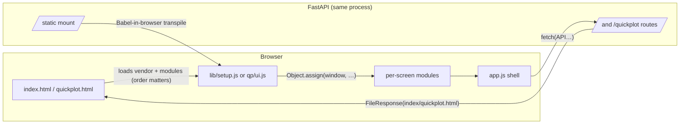
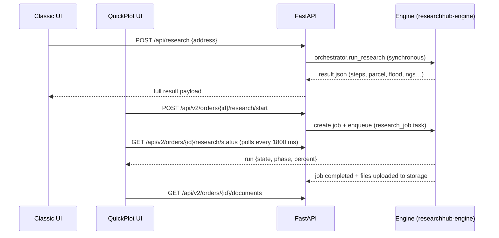

# 03 — Frontend Deep Dive (Frontend team)

The complete map of the two UIs: **Classic** (the address-first tool at `/`) and **QuickPlot**
(the Mapperty-styled order-centric research hub at `/quickplot`). Both are single-file React
apps with **no build step** — Babel transpiles in the browser, React + Babel are served
locally from `frontend/vendor/`, and both talk to the same FastAPI process.

> Physical location today: `poc01/SurveyResearch/frontend/` (alongside the POC backend). At
> integration, these files move into the parent repo unchanged — the static file mount
> (`StaticFiles` on `/static`) and the two routes below are what make that work without a build.

## 0. No-build anatomy (both apps)



Rules that keep it working:
- `<script type="text/babel">` runs in **document order** — the "load order matters" comments in
  both HTML files are load-bearing (`frontend/index.html:19` comment; `frontend/quickplot.html:19`).
- Modules can't `import`; every file ends with `Object.assign(window, {…})` publishing its
  declarations (see `frontend/src/app.js:73`, `frontend/src/qp/ui.js:298`).
- JSX must stay **valid XML** — a stray unclosed tag renders the whole page blank (Babel stops
  mid-transpile), so edits arrive as balanced tags, and preview on a hard refresh.
- No-cache is enforced server-side (`backend/app/main.py:35` `_revalidate_frontend` sets
  `Cache-Control: no-cache, must-revalidate` on `/`, `/quickplot`, and `/static/*`) — an edit
  shows on a plain refresh.

## 1. Classic (address-first) — `/`

### The shell — `frontend/index.html` + `frontend/src/app.js`

`index.html` loads four vendor libs (React production, ReactDOM production, Babel, Tailwind —
all tiny local copies, **no CDN**), then the modules in dependency order: `lib/setup.js` →
`primitives.js` → `documents.js` → `DocViewer.js` → `Row.js` → `Results.js` → `search.js` →
`jobs.js` → `about.js` → `locker.js` → `app.js` (`frontend/index.html:19-29`).

`App()` (`frontend/src/app.js:3`) owns one state blob `search` — `{mode, addr, pid, st,
result, loading, error}` — and a top nav of four views: **Search / Jobs / Evidence Locker /
About** (`app.js:7-8`). The left rail is a fixed `w-60` sidebar with the G-Source gradient
(`#242a63 → #2c357e`) and `#33409E` accent.

- `runSearch` (`app.js:13`) supports two modes: `address` (POST `{address}` to
  `/api/research`) and `parcel` (POST `{parcel_id, state}`). An `AbortController` is kept in
  `abortRef` so `cancelSearch` can abort the in-flight fetch mid-run (`app.js:25-37`).
- The content area renders the current view: `Search`, `Jobs`, `EvidenceLocker`, `About`
  (`app.js:59-62`).

### The shared toolbox — `frontend/src/lib/setup.js`

The classic app's global utilities:
- `API = ""` — same-origin, so the app works unchanged behind the FastAPI process
  (`setup.js:4`).
- `icons.*` — 20+ inline SVG paths (search, folder, locker, droplet, target, …) (`setup.js:11-41`)
  plus `docIcon(key)` mapping document keys (parcel/appraiser/deed/plat/…) to icons (`:50`).
- `viewableType(fn)` → `pdf | image | html | other` for the in-app viewer (`:43`).
- `jobFileUrl(jobName, fn, download)` → `/api/jobs/file?name=…&file=documents/<fn>` (`:44`).
- `aerialUrl(lat, lon)` → **free keyless Esri World Imagery** static export (Web-Mercator bbox
  around the lot) used as the aerial thumbnail on search results (`:46-48`).
- `attrGet(attrs, …needles)` — case-insensitive situs-field picker used to compose the parcel
  address from a CAMA/parcel payload (`:49`).

### The screens

| File | Component(s) | What it does |
|---|---|---|
| `components/search.js` | `Search`, `Loader`, `Fact` | Address/parcel form, state+county+city dropdowns (counties + cities + parcel-states are fetched from `/api/reference/*`), a big elapsed-timer loader while `/api/research` runs, verdict + notes hooks after results return |
| `components/Results.js` | `Results` | Sorts steps by requirement order (mandatory → conditional → recommended), shows the aerial thumbnail, parcel lot facts, per-step download/view status, and the "send to Evidence Locker" selection set |
| `components/Row.js` | `Row` | One document row: status dot, files, verdict chips, in-locker badges, view/download/manual-upload buttons |
| `components/documents.js` | `Access`, … | The step's via-link access block (calls `jobFileUrl` to view/download) and uploaded-file chips |
| `components/DocViewer.js` | `DocViewer` | In-app viewer: loads the file as a blob, renders PDF/HTML/image/"other", records the surveyor's match-mismatch **verdict** + note via `/api/feedback` |
| `components/jobs.js` | `Jobs`, `JobDetail` | Jobs list (`/api/jobs`) + detail (`/api/jobs/detail`) incl. manifest summary and per-doc file download |
| `components/locker.js` | `EvidenceLocker` | Order-scoped Evidence Locker: list `/api/evidence`, detail `/api/evidence/detail`, delete item `/api/evidence/item`, delete order, serve file `/api/evidence/file` |
| `components/about.js` | `About`, `StateTracker`, `ConnectionCheck` | Coverage tracker (live from `/api/reference/coverage`), release notes, and the Connection Check that probes `/api/linkcheck?portals=1` |
| `components/primitives.js` | `Logo`, `Brand` | G-Source hexagon mark + sidebar brand block |
| `styles/app.css` | — | Brand tokens `--gs:#33409E`, `--gs-d:#242a63`, `--gs-red:#E4482B`, scrollbar/skeleton/spin/fade utilities (16 lines) |

## 2. QuickPlot (order-centric) — `/quickplot`

### The shell — `frontend/quickplot.html` + `frontend/src/qp/app.js`

`quickplot.html` loads React + Babel only — **Tailwind is deliberately absent** — and ships its
own design system (`frontend/src/qp/quickplot.css`). Load order: `ui.js` (primitives + API
client) → `modals.js` → `research.js` → `orders.js` → `app.js` (`quickplot.html:20-24`).

`App()` (`frontend/src/qp/app.js:50`) is the shell: header (logo, tenant chip from `/api/v2/
meta`, notifications, avatar), sidebar (`Users / Orders / Support / Quote hub`), and a **hash
router**:

```js
function parseHash() {                       // qp/app.js:40
  const h = (location.hash || "#/orders").replace(/^#\/?/, "");
  const parts = h.split("/").filter(Boolean);
  if (parts[0] === "orders" && parts[1] && parts[2] === "research")
    return { view: "research", id: parts[1] };
  if (parts[0] === "orders" && parts[1]) return { view: "order", id: parts[1] };
  return { view: parts[0] };
}
```

So `#/orders`, `#/orders/:id`, `#/orders/:id/research` are the three real screens; `users`,
`support`, `quote` render `Placeholder` ("lives in the main Mapperty app") — a deliberate
slice so the hub can be reviewed in its real surroundings and later **embedded with Mapperty's
own nav** (`app.js:29-37`). A `hashchange` listener re-parses + scrolls to top (`app.js:54-59`).

### The API client — `frontend/src/qp/ui.js`

One function knows the auth headers — everything else in the UI just calls it (`ui.js:14`):

```js
async function api(path, opts = {}) {
  const headers = { "X-Org-Id": QP.org, "X-Actor": QP.actor, ...(opts.headers || {}) };
  if (opts.json !== undefined) { headers["Content-Type"] = "application/json";
    opts.body = JSON.stringify(opts.json); delete opts.json; }
  const r = await fetch("/api/v2" + path, { ...opts, headers });
  ...
  if (!r.ok) throw new Error(data.detail || data.message || `HTTP ${r.status}`);
  return data;
}
```

`QP` (`ui.js:9`) reads `org` and `actor` from `localStorage` (`qp.org`, `qp.actor`) with
`"default"` / `"Owen Ranford"` defaults — this is the single place auth tokens replace them.
`fileUrl(orderId, docId, download)` builds the `/api/v2/orders/{id}/documents/{id}/file`
endpoint (`ui.js:29`).

The file also carries: formatters (`fmtBytes/fmtDate/fmtTime/fmtStamp/fmtNum/initials`),
`x`/`fileKind` utilities, 35 SVG icons (`ic.*`), and the shared components —

| Component | Purpose |
|---|---|
| `Btn`, `Chip`, `Spinner`, `Empty` | Base building blocks tuned to the token palette |
| `Modal`, `Drawer` | Overlays (Escape-to-close, scrim-click close) |
| `Toasts` + `toast()` | Global side-channel, `_toastBus` — the only global mutable |
| `useAsync(fn, deps)` | Load-spinner-error state machine used by every data screen |
| `MapThumb` | Free keyless Esri World Imagery thumbnail around `lat/lon` |
| `SearchInput`, `useDebounced` | Debounced search box (300 ms, one request per phrase) |

### The screens — `frontend/src/qp/orders.js`

- `OrdersList` (`orders.js:428`) — table of orders with live search (`/orders?q=…`, debounced),
  stage + research chips, locked/document counts, and the "Seed sample order" button calling
  `POST /demo/seed` when the list is empty (`orders.js:438`). "New Order" opens
  `OrderFormModal`.
- `OrderFormModal` (`orders.js:137`) — 14 ORDER_FIELDS + client + access-contact blocks;
  `validateOrder` (`orders.js:117`) mirrors the **server** rules (needs title/number/address/
  parcel; due ≥ received; valid email; 2-letter state) so typos surface before a round trip.
  POST `/orders` or PATCH `/orders/{id}`.
- `OrderDetail` (`orders.js:246`) — header, `ResearchBanner` (the single CTA, wording tracks
  `research_state`: not_started → "Start Research" → in_progress → "Resume research" →
  submitted banner, `orders.js:37-72`), `StageRail` (`orders.js:9`, six stages
  created→placed→research→field_survey→cad_drafting→delivered), property card, and two tabs:
  **Order Information** and **Evidence locker** (downloads via `fileUrl(…, true)`). "Locker
  Log" / "Order Log" open `LogModal`.
- `ResearchBanner.start` routes to the research hub, calling `POST /research/start` first if the
  order hasn't started (`orders.js:263-270`).

### The research hub — `frontend/src/qp/research.js`

The "Gather the research set" screen (`ResearchHub`, `research.js:168`):

- **Initial load** (`research.js:201-219`): `Promise.all` of `/orders/{id}`, `/doc-types`,
  `/orders/{id}/research/status`, then docs + sources in parallel.
- **Polling** (`research.js:222-240`): only while `run.state === "running"`, every **1800 ms**,
  hits `/research/status`; on completion reloads docs + sources + order and toasts
  finished/error. The interval lives in `pollRef` and is cleaned up when not running.
- **Fetch actions**: `fetchOne(key)` → `POST /orders/{id}/sources/{key}/fetch`;
  `fetchAll()` → `POST /orders/{id}/sources/fetch-all` (`research.js:242-253`).
- **`SourceRail`** (`research.js:48`) shows the source registry with per-source state chips
  (`idle/fetching/fetched/failed/unavailable` → "In locker" / "Auto fetch failed" / "Link
  only", `research.js:5-11`), the "Open source" link, and Retry / Auto fetch buttons
  ("Auto-Fetch All" disabled while a run is in flight).
- **`DocRow`** (`research.js:87`) — per document: type picker (locked ones are read-only),
  status chip, download/re-fetch/delete actions, and **Review & lock** (disabled until a
  `doc_type` is chosen). Optimistic `doc_type` PATCH (`research.js:254-258`) with rollback
  reload on error.
- **`RunningPanel`** (`research.js:142`) — the empty-state animation during a run: the server's
  phased label list + progress bar (`run.percent`).
- Sticky footer (`research.js:402`): Save & Exit / Submit Research gates.

### The dialogs — `frontend/src/qp/modals.js`

- **`ReviewDocModal`** (`modals.js:16`) — the defensive lock: three confirmation checks
  (`legible`, `matches_parcel`, `source_recorded`; `CONFIRMS`, `modals.js:7`) must ALL be on
  before "Approve & Lock" enables, then a second confirm modal ("Locking is permanent.")
  before `POST /documents/{id}/lock` fires with the three booleans (`modals.js:28-41`). The
  viewer renders images directly or an `<iframe>` for PDF/html.
- **`UnlockModal`** (`modals.js:127`) — reason required (recorded in the change log) →
  `POST /documents/{id}/unlock`.
- **`DeleteDocModal`** (`modals.js:166`) — `DELETE /documents/{id}?reason=…`.
- **`UploadModal`** (`modals.js:205`) — drag-and-drop; **one request per file** (so a single
  rejected file doesn't lose a batch), each row carrying its `doc_type`; `POST /documents`
  with a FormData `files` + `doc_type`.
- **`SubmitModal`** (`modals.js:301`) — fetches `/research/summary`, shows locked/document/
  review counts, hard-blocks submit when **zero locked** (`modals.js:325`);
  `POST /research/submit` with an optional note.
- **`LogModal`** (`modals.js:392`) — `/orders/{id}/log?scope=locker|order` rendered per action
  type with icons via `LOG_ICON` (`modals.js:360`).
- **`ChecklistDrawer`** (`modals.js:409`) — `/orders/{id}/checklist`; a row ticks only when a
  **locked** document of that type exists (the checklist-on-locked rule is enforced here in
  the UI and again in the API).

### The design system — `frontend/src/qp/quickplot.css`

516 lines of plain CSS generated from the **Mapperty Figma token export** (file header,
`quickplot.css:1-4`). The `:root` block (`quickplot.css:6-54`) is the contract every component
uses:

- Brand ramp `--b-600: #3FA424` (primary action), `--b-500:#61D32F`, gradient
  `--b-grad`; neutrals `--g-*`; semantic `--warn/--danger/--info`; radii **8 / 12 / 16 px**
  (`--radius/-lg/-xl`); shadows `--shadow-xs/sm/lg`; layout `--header-h:62px`,
  `--sidebar-w:245px`; font **Figtree** (`--font`).

The `--b-*`/`--g-*` names are referenced directly in JSX (`style={{ color: "var(--b-600)" }}`),
so tokens are SWAPPABLE per-tenant — a white-label build only changes this file.
Animations `qp-spin/fade/slide/pop` and the `scroll` scrollbar underpin the micro-UI.

## 3. How the two UIs meet the same engine



Classic calls the **synchronous** `orchestrator.run_research` (deep-deep-dive §8) and shows the
whole result at once. QuickPlot calls the **async job API** (`/api/v2/research/*` of
`researchhub-engine`), polls status, and only then lists the uploaded evidence. Same engine,
two rhythms — that's the "two UIs, one process" story end to end.

## 4. Frontend seams at integration

| Seam | Where | What changes |
|---|---|---|
| `API = ""` (classic) / `fetch("/api/v2…")` (QP) | `lib/setup.js:4`, `qp/ui.js:21` | stays same-origin behind Mapperty's host |
| `QP.org` / `QP.actor` | `qp/ui.js:9-12` | swap `localStorage` reads for the Cognito token in `api()`; nothing else changes |
| Sidebar nav Users/Support/Quote | `qp/app.js:20-25` | replaced by Mapperty's own routed nav when embedded |
| `/static`, `/`, `/quickplot` mounts | `backend/app/main.py:464-484` | same routes serve from the parent's static bucket |
| Tailwind (classic only) | `index.html:12` | stays local; no CDN dependency survives integration |