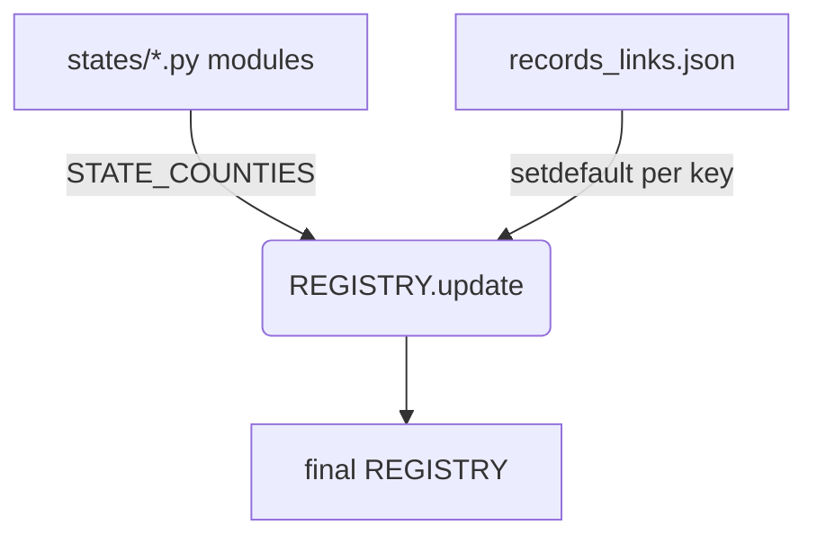

# 04 — Data Sources Registry (BA + backend team)

How the app decides **where** to look, in what order, and when to trust the result. All paths
are in this repo's `backend/app/data/` + `backend/app/services/`.

## 0. The five files that ARE the registry

| File | Contents | Role |
|---|---|---|
| `data/county_platforms.py` | `REGISTRY` — per-county entries keyed by **5-digit FIPS** (county + state), with `county`, `state`, optional `clerk_url`/`clerk_platform`, `appraiser_url`, `gis_rest` (ArcGIS MapServer), `parcel_layer_hint`, `appraiser_api`, `situs_exclude`, `clerk_note` | the runtime lookup the pipeline reads |
| `data/states/` package | one module per state exporting `STATE`, `PARCEL` (statewide service), `COUNTIES` (per-county overrides), `DEED_LINK`, `PLAT_LINK`, `APPRAISER_LINK` | country-scale coverage without a giant file |
| `data/records_links.json` | **bulk-verified** clerk + appraiser links for hundreds of counties (351 entries today), each carrying `_src_clerk_url` provenance | TX's 254 CADs etc. without hand-writing |
| `data/geography.py` | states/counties list + **live Census TIGERweb** city picker per county | dropdowns, FIPS normalization |
| `data/reference.py` | `SURVEY_TYPES`, `RESIDENTIAL_DOCS` (the 11 doc steps in declared order), `DOC_MATRIX` (which docs each survey type needs), `SOURCES` | the survey matrix |

Entry example, Volusia FL (`county_platforms.py:21-28`):

```python
"12127": {  # Volusia
    "county": "Volusia", "state": "FL",
    "clerk_url": "https://app02.clerk.org/or_m/",     # note: /or_m/, not /or — portal moved
    "clerk_platform": "inhouse",
    "appraiser_url": "https://vcpa.vcgov.org/searches.html",
    "gis_rest": None,
},
```

## 1. Merge precedence (the rule that keeps curated data safe)



1. `REGISTRY` is seeded with the hand-verified FL counties (`county_platforms.py:19`).
2. Every state module's `COUNTIES` overrides are merged via `REGISTRY.update(...)` — a
   state-module value **replaces** a registry value for the same key (`county_platforms.py:502`).
3. `records_links.json` is merged **last**, and **only fills empty keys** — every key applied
   with `cur.setdefault(k, v)` (`county_platforms.py:522-528`). A curated state-module entry
   (richer notes, a scraper platform, a parcel service) is never clobbered by the bulk file.
4. The four aggregate dicts (`STATE_PARCEL`, `STATE_COUNTIES`, `STATE_DEED`, `STATE_PLAT`,
   `STATE_APPRAISER`) are built by a `pkgutil.iter_modules` loader over `data/states/`
   (`states/__init__.py:20-31`) — adding a state = adding one file.

`lookup(fips)` (`county_platforms.py:544`) is the only read path the pipeline uses.
`netronline(state_abbr, county_name)` (`:548`) builds the always-available directory deep-link
so **every county on Earth has a clerk/appraiser fallback**, even one not in the registry.

## 2. The six data authorities and where each is used

### 1) US Census Geocoder — address → lat/lon
`services/geocode.py`; endpoint `https://geocoding.geo.census.gov/geocoder/` (part of
`_CORE_ENDPOINTS`, `backend/app/main.py:393`). ArcGIS + Nominatim fallbacks. The geocoder
point is what the parcel step re-buffers — **it lands on street centerlines and can miss the
parcel polygon by 100–200 m** (observed 92 m and ~185 m in tests, going onto the neighbor). See
"Trust only on an address match" below.

### 2) Census TIGERweb — states / counties / cities
`services` = none of the engines'; it powers the dropdowns:
- states + counties: `data/geography.py` over the bundled `_counties_raw.json` (16 288 rows,
  nationwide) and `state_fips()/counties()/county_name()`.
- cities: **live** `cities(county_fips)` queries TIGERweb Places layers 4 (Incorporated) + 5
  (Census Designated Places) — `geography.py:18-22`, `:120` — so the City dropdown is always
  current, per county, nationwide (cached).

### 3) Parcel services — county `gis_rest` → statewide → appraiser link
Traced in `services/parcel.py`:
1. **County `gis_rest`** (an ArcGIS MapServer; query runs through the shared session, POST for
   geometry-heavy queries via `http.post_json`, `services/http.py:25`).
2. **`STATE_PARCEL`** — a statewide FeatureServer, e.g. TX StratMap (`data/states/tx.py`,
   `PARCEL` block). **Do not "fix" the TX URL**: it still says `2019_Texas_Parcels_StratMap` but
   serves the **2025** vintage, 14.3 M parcels.
3. **Appraiser / NETROnline** link only — the "one click away" fallback for the ~1,062 counties
   with no queryable parcel service.

Per-county overrides that matter: `situs_exclude` and `compose_situs` (`parcel.py:153-157`).
When a CAMA layer carries both situs and owner mailing address, `situs_exclude` names the
mailing fields so the owner's mailbox address never leaks into the composed situs used for the
address match.

**Trust only on an address match.** `_candidates()` (`parcel.py:331-355`) widens the query box
in steps (`75 m → 150 m → 300 m`) and stops at the **first** radius whose parcel set contains a
situs that matches the searched address (`_addr_match`, `parcel.py:215`); `_finish` flags
`buffered_match: true` + `address_match` so a mis-geocode landing on a neighbor still resolves
the true parcel, while a *cross-street* miss is tagged "verify" instead of silently adopting a
wrong polygon (`parcel.py:431-432`).

### 4) FEMA NFHL — flood zone + map
`services/fema.py` against `hazards.fema.gov/arcgis/rest/services/public/NFHL/MapServer` (core,
`main.py:395`). The FloodAdapter (`02 §8`) accepts the zone JSON **or** a composited map
exhibit — `services/downloader.py` renders the panel with **Pillow** and saves the PNG so the
evidence has a human-readable map, not just a JSON code. Sandbox note: this network blocks
`hazards.fema.gov` (TLS reset) — test the fallback-link path from here, not the fetch.

### 5) NOAA NGS — survey control / benchmarks
`services/ngs.py` against `geodesy.noaa.gov` (core, `main.py:397`). Radial search around the
lot; up to 3 datasheets downloaded (`NGS_datasheet_AK1659.html` is the E2E artifact). Returns
`empty` (not `error`) when no marks exist nearby — "none found" is a valid research answer.

### 6) County Clerk / Recorder — deeds, plats
`services/clerk_scraper.py` — **Playwright** against county portals; scraper adapters per
platform:
- **NewVision BrowserView** (NJ Middlesex/Morris/Cape May), **AcclaimWeb** (NJ Somerset),
  **Tyler/Eagle** (FL Manatee/Volusia families), Kofile **PublicSearch** (`<county>.tx.publicsearch.us`,
  53 TX counties), Kofile **County Fusion** (`countyfusion<N>.kofiletech.us/...?countyname=…`,
  TX + OH). All in `_scrape_documents` — **one browser launch per order**, cached on
  `ctx._clerk_docs`, so deed and plat steps never open the browser twice.
- `appraiser.py` — Polk CAMA record card download; everywhere else the tax card is generated
  from the parcel records, with a VERIFIED appraiser portal link (Georgia: `qpublic.net/ga/<slug>/`);
  Texas: Comptroller county directory per county.
- Anything on an `inhouse`/`unknown` platform with no scraper → the `_link_only_clerk_adapter`
  returns the verified clerk `link` (never fabricates one).

## 3. The coverage gates (what "adding a county" means)

`/api/reference/coverage` (`main.py:247-388`) computes everything **live from the registry**,
with two edge-case corrections built in:

- **`id_only` statewide layers don't count** (`main.py:294-296`): Ohio's ODNR layer answers
  Parcel-ID lookups but carries no situs, so it can't auto-fetch from an address — the app's
  real entry point. Treating it as "statewide" would credit OH all 88 counties when only 33
  resolve. Expect the same caveat on any `id_only` service you add.
- **Partial statewide** (`counties_covered`, `main.py:300`): TN's layer covers 86/95 counties,
  CO's ~38/64. The gate caps the credit at the declared count.

**Adding a county parcel service — verify COVERAGE, not reachability.** A layer that *loads*
is not enough. A found candidate layer must:
1. return a parcel for **≥60% of a grid of points inside the county polygon** (a bbox or single
   point check passes city-only / study-area look-alikes — Walton GA's reachable copy covers 8%,
   Ware GA's parcels×soils intersect has 3× the true row count);
2. expose a **parcel-id field**; and
3. be checked for **situs vs mailing** fields, setting `situs_exclude` on CAMA layers carrying
   both.

This is the single most-common failure mode in the regional GIS orgs' catalogs — the
documented gate is the guard. (Harness support: `scripts/discover_state_parcels.py`,
`scripts/verify_situs_fields.py`, `scripts/audit_parcel_candidates.py`.)

## 4. Link verification + Connection Check

`services/http.py:33` `check_url` returns one of four verdicts — the Connection Check surface
(`/api/linkcheck`, `main.py:402-432`) reflects the **user's own** network + K7:

| Verdict | HTTP evidence | Meaning for the user |
|---|---|---|
| `ok` | status < 400 | reachable, expected |
| `blocked` | 401 / 403 / 406 / 429 | bot/geo WAF block — **opens fine in a browser**; don't treat as dead |
| `broken` | 404 / 410 / 5xx | URL/path wrong or server error — fix the URL (portals move: Volusia `/or/` → `/or_m/`) |
| `offline` | no HTTP response (TLS reset / timeout) | AV/firewall/Egress blocking — the K7 case or a sandbox VPN |

The shared `session` (`http.py:8-16`) carries the app's `User-Agent`, retries
429/500/502/503/504 with backoff, and is reused by the fast two-click `check_url`
(`allow_redirects=True, stream=True`).

## 5. The survey matrix (`data/reference.py`)

`RESIDENTIAL_DOCS` (from `POI = apartment/office…` families) is the agreed order the engine
runs: the 11 steps (parcel, appraiser, **deed, plat, adjoiners, easements, prior_survey, condo**,
flood, benchmarks/ngs, glo) with their `requirement` (mandatory → conditional → recommended).
`DOC_MATRIX` maps survey_type → the subset of docs that survey needs, and `SURVEY_TYPES` lists
the supported types — a new survey type = a matrix row, nothing else.

## 6. Live numbers to quote (recompute command: hit `/api/reference/coverage`)

- National parcel auto-fetch: **2,082 / 3,144 counties = 66.2%** (and higher order-weighted).
- FL **51.7%** of order volume: parcels 67/67, deed+plat 67/67, appraiser 67/67.
- GA **33.8%**: parcels 90/159 (Schneider/qPublic HTML counties need the paid API — deeds/plats
  and appraiser are 100% via GSCCCA + qpublic.net).
- TX **7.1%**: parcels 254/254 (StratMap), clerk per-CAD directory, appraiser 254/254.
- OH **1.5%** (33/88 situs-resolvable), NJ **1.1%** (21/21 all three).